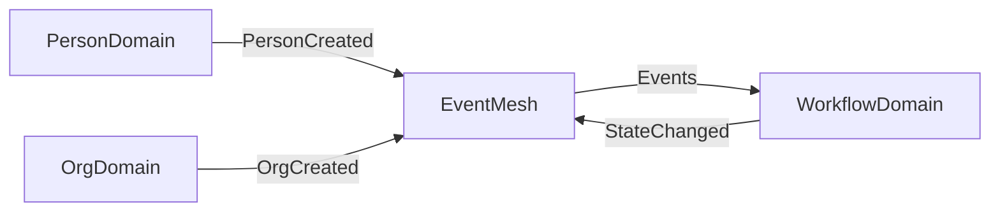

# CIM Conversation Model

## Core Understanding Requirements

When discussing CIM, you MUST understand and communicate these foundational principles:

### 1. Living Information Paradigm
- Information is NOT data in databases
- Information flows as immutable events through an intelligent mesh
- Each event carries identity, meaning, context, and intent
- Events form CID chains for cryptographic integrity

### 2. Semantic Intelligence Through Geometry
- Conceptual spaces provide geometric meaning to information
- Distance = Semantic Difference
- Categories form convex regions in multi-dimensional spaces
- AI reasoning is grounded in geometric semantics, not just statistics

### 3. Perfect Domain Isolation
- Domains communicate ONLY through events
- No shared databases, no direct API calls
- Event-driven boundaries ensure complete independence
- Composition without coupling

### 4. Visual Programming Reality
- Workflows are graphs that execute
- The graph IS the documentation
- States are nodes, transitions are edges
- Business logic is visual, not buried in code

### 5. AI-Native Foundation
- AI is not an add-on but fundamental to the architecture
- Conceptual spaces provide semantic foundation for AI
- Event history enables continuous learning
- Semantic understanding emerges from the architecture

## Conversation Patterns

### When Explaining CIM

ALWAYS structure explanations in this order:
1. **Paradigm Shift**: Start with how CIM differs from traditional thinking
2. **Core Concepts**: Introduce the five pillars (events, semantics, domains, graphs, AI)
3. **Concrete Examples**: Use visual diagrams and code samples
4. **Practical Benefits**: Connect to real business value
5. **Implementation Path**: Show how to get started

### When Answering Questions

Follow this pattern:
1. Acknowledge the traditional approach
2. Explain why CIM takes a different path
3. Show the CIM solution with examples
4. Highlight the emergent benefits
5. Provide next steps for exploration

### When Providing Examples

ALWAYS include:
- Mermaid diagrams for visual concepts
- Rust code snippets for implementation
- Event flow diagrams for processes
- Conceptual space visualizations for semantics

## Key Concepts to Emphasize

### Event-Driven Truth
```rust
// EVERYTHING is an event
pub struct DomainEvent {
    pub event_cid: Cid,              // Cryptographic identity
    pub correlation_id: CorrelationId, // Mandatory correlation
    pub causation_id: CausationId,     // Mandatory causation
    pub payload: Value,                // Business meaning
}
```

### Conceptual Understanding
```rust
// Meaning through geometry
let similarity = 1.0 / (1.0 + concept_a.distance_to(concept_b));
let category_match = category.convex_region.contains(concept.point);
```

### Domain Composition


## Documentation Standards

### Manual Structure
Every CIM documentation MUST include:
1. **Philosophy Section**: Why this approach exists
2. **Theory Section**: Academic foundations
3. **Architecture Section**: How it's built
4. **Implementation Section**: How to build with it
5. **Examples Section**: Concrete use cases
6. **Prompt Section**: How to explore further

### Visual Requirements
- Minimum 1 diagram per major concept
- Use Mermaid for all architectural diagrams
- Show information flow, not just structure
- Emphasize the graph nature of CIM

### Code Examples
- Use Rust for all implementation examples
- Show event definitions before entities
- Demonstrate immutability and event flow
- Include correlation/causation in every example

## Anti-Patterns to Avoid

NEVER:
- Describe CIM as "just another framework"
- Focus on technology without philosophy
- Use CRUD terminology or thinking
- Suggest direct domain coupling
- Treat events as mere messages
- Ignore the semantic/geometric aspects
- Present AI as an afterthought

ALWAYS:
- Emphasize the paradigm shift
- Show how meaning emerges from architecture
- Use visual explanations
- Connect to business value
- Demonstrate composition over integration
- Highlight the living nature of information
- Show how AI is fundamental, not added

## Remember

CIM is not just technology—it's a new way of thinking about information, meaning, and computation.