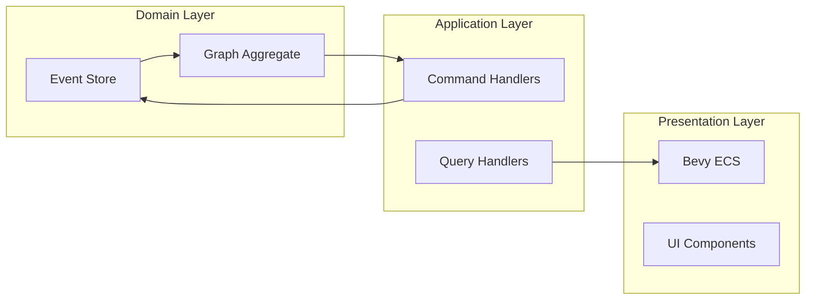
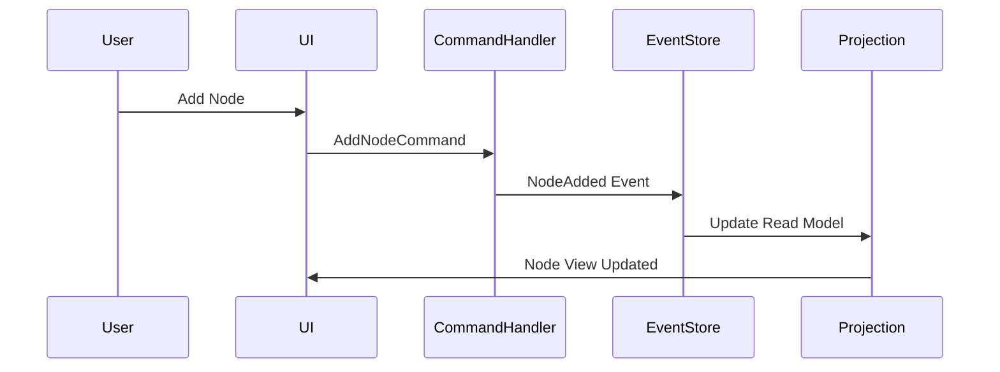
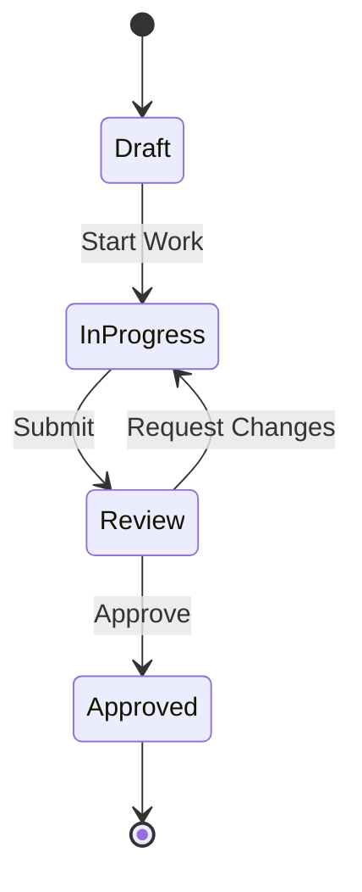
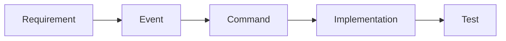
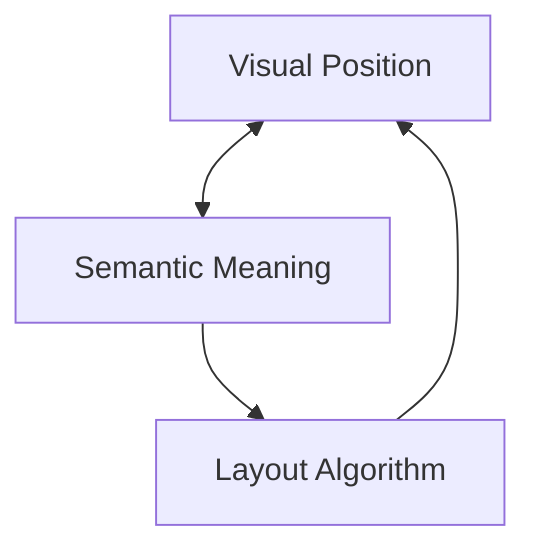

# Graph Patterns and Mermaid Diagram Requirements

## Core Graph Architecture

Graphs in CIM serve as the primary visualization and interaction layer for:
- **Domain-Driven Workflows**: Visual representation of business processes
- **Conceptual Spaces**: Geometric knowledge representation
- **Event Flows**: Visualization of event-sourced state changes
- **Dog-fooding**: Self-visualization of CIM's own development

## Mermaid Diagram Requirements

### MANDATORY: Include Mermaid Diagrams in Rustdoc

All graph-related modules MUST include mermaid diagrams in their documentation:

```rust
/// Graph System Architecture
/// 
/// ```mermaid
/// graph TB
///     EventStore[NATS JetStream<br/>Event Store]
///     GraphAggregate[Graph Aggregate<br/>Domain Logic]
///     ReadModel[Read Model<br/>Query Optimization]
///     BevyBridge[Async/Sync Bridge]
///     BevyECS[Bevy ECS<br/>Visualization]
///     
///     EventStore -->|Events| GraphAggregate
///     GraphAggregate -->|Commands| EventStore
///     GraphAggregate -->|Project| ReadModel
///     ReadModel -->|Query| BevyBridge
///     BevyBridge -->|Sync| BevyECS
/// ```
pub struct GraphSystem {
    // Implementation
}
```

### Standard Diagram Types

1. **Architecture Diagrams**


2. **Event Flow Diagrams**


3. **State Machine Diagrams**


## Graph Domain Model

### Core Structure
```rust
pub struct GraphSystem {
    event_store: EventStore,        // NATS JetStream persistence
    write_model: GraphAggregate,    // Command processing
    read_model: GraphReadModel,     // Query optimization
    bevy_bridge: AsyncSyncBridge,   // Real-time updates
}
```

### Graph Aggregate
```rust
#[derive(Debug, Clone)]
pub struct GraphAggregate {
    pub id: GraphId,
    pub name: String,
    pub graph_type: GraphType,
    pub nodes: HashMap<NodeId, Node>,
    pub edges: HashMap<EdgeId, Edge>,
    pub conceptual_mapping: ConceptualMapping,
    pub version: u64,
    pub last_event_cid: Option<Cid>,
}
```

## Event Store with CID Chains

### Event Structure
```rust
/// Domain Event with CID Chain
/// 
/// ```mermaid
/// graph LR
///     E1[Event 1<br/>CID: abc123]
///     E2[Event 2<br/>CID: def456<br/>Prev: abc123]
///     E3[Event 3<br/>CID: ghi789<br/>Prev: def456]
///     
///     E1 --> E2
///     E2 --> E3
/// ```
#[derive(Serialize, Deserialize)]
pub struct DomainEvent {
    pub event_id: EventId,
    pub aggregate_id: AggregateId,
    pub event_type: String,
    pub payload: serde_json::Value,
    pub sequence: u64,
    pub timestamp: SystemTime,
    pub event_cid: Option<Cid>,      // Content-addressed identifier
    pub previous_cid: Option<Cid>,   // Chain to previous event
    pub metadata: EventMetadata,
}
```

## CQRS Implementation

### Write Model (Commands)
```rust
/// Command Flow
/// 
/// ```mermaid
/// graph LR
///     Command[AddNode Command]
///     Handler[Command Handler]
///     Aggregate[Graph Aggregate]
///     Event[NodeAdded Event]
///     Store[Event Store]
///     
///     Command --> Handler
///     Handler --> Aggregate
///     Aggregate --> Event
///     Event --> Store
/// ```
impl GraphAggregate {
    pub async fn handle_command(&mut self, cmd: GraphCommand) -> Result<Vec<DomainEvent>, Error> {
        match cmd {
            GraphCommand::AddNode { node } => {
                // Validate business rules
                // Generate events
                // Update state
            }
        }
    }
}
```

### Read Model (Queries)
```rust
/// Query Optimization
/// 
/// ```mermaid
/// graph TB
///     Query[Query Request]
///     Cache{Cache Hit?}
///     Index[Pre-computed Index]
///     Result[Query Result]
///     
///     Query --> Cache
///     Cache -->|Yes| Result
///     Cache -->|No| Index
///     Index --> Result
/// ```
pub struct GraphReadModel {
    node_views: DashMap<NodeId, NodeView>,
    metrics: Arc<RwLock<GraphMetrics>>,
    query_cache: QueryCache,
}
```

## Component Deduplication

### Memory Optimization Pattern
```rust
/// Flyweight Pattern for Components
/// 
/// ```mermaid
/// graph TB
///     N1[Node 1]
///     N2[Node 2]
///     N3[Node 3]
///     
///     C1[Component A<br/>Ref Count: 2]
///     C2[Component B<br/>Ref Count: 1]
///     C3[Component C<br/>Ref Count: 2]
///     
///     N1 --> C1
///     N1 --> C3
///     N2 --> C1
///     N3 --> C2
///     N3 --> C3
/// ```
pub struct ComponentStorage {
    components: HashMap<ComponentId, Arc<Component>>,
    reference_counts: HashMap<ComponentId, usize>,
}
```

## Async/Sync Bridge

### Bridge Architecture
```rust
/// Event Synchronization
/// 
/// ```mermaid
/// sequenceDiagram
///     participant NATS as NATS (Async)
///     participant Bridge
///     participant Bevy as Bevy (Sync)
///     
///     NATS->>Bridge: Event Stream
///     Bridge->>Bridge: Buffer Events
///     Bevy->>Bridge: Poll Events
///     Bridge->>Bevy: Event Batch
///     Bevy->>Bevy: Update ECS
/// ```
pub struct AsyncSyncBridge {
    command_tx: crossbeam::channel::Sender<BridgeCommand>,
    event_rx: crossbeam::channel::Receiver<BridgeEvent>,
}
```

## Conceptual Space Integration

### Semantic Positioning
```rust
/// Conceptual Mapping
/// 
/// ```mermaid
/// graph LR
///     subgraph "Visual Space"
///         VP[Visual Position<br/>(x, y, z)]
///     end
///     
///     subgraph "Conceptual Space"
///         CP[Conceptual Point<br/>(d1, d2, ..., dn)]
///     end
///     
///     VP -->|Map| CP
///     CP -->|Layout| VP
/// ```
pub struct ConceptualMapping {
    space_id: ConceptualSpaceId,
    dimension_mappings: Vec<DimensionMapping>,
    position_calculator: Box<dyn PositionCalculator>,
}
```

## Performance Patterns

### Query Optimization
```rust
/// Query Performance Strategy
/// 
/// ```mermaid
/// graph TB
///     Request[Query Request]
///     
///     subgraph "Optimization Layers"
///         L1[L1: Cache<br/>< 1ms]
///         L2[L2: Index<br/>< 5ms]
///         L3[L3: Scan<br/>< 10ms]
///     end
///     
///     Request --> L1
///     L1 -->|Miss| L2
///     L2 -->|Miss| L3
/// ```
pub struct QueryCache {
    cache: Arc<RwLock<LruCache<QueryKey, QueryResult>>>,
    hit_rate: Arc<AtomicU64>,
}
```

## Testing Patterns

### Graph Invariant Tests
```rust
/// Test Event Chain Integrity
/// 
/// ```mermaid
/// graph LR
///     T1[Test: Create Event 1]
///     T2[Test: Create Event 2]
///     V1[Verify: CID Chain]
///     V2[Verify: Sequence]
///     
///     T1 --> T2
///     T2 --> V1
///     V1 --> V2
/// ```
#[tokio::test]
async fn test_event_chain_integrity() {
    let event1 = store.append_event(...).await?;
    let event2 = store.append_event(...).await?;
    
    assert_eq!(event2.previous_cid, event1.event_cid);
    assert!(verify_cid_chain(&[event1, event2])?);
}
```

## Dog-fooding Visualization

### Self-Visualization Pattern
```rust
/// Development Progress Graph
/// 
/// ```mermaid
/// graph TB
///     subgraph "Current Sprint"
///         F1[Feature: Graph System]
///         F2[Feature: Event Store]
///         T1[Task: Implement CID]
///         T2[Task: Add Tests]
///     end
///     
///     subgraph "Dependencies"
///         D1[NATS Integration]
///         D2[Bevy 0.16]
///     end
///     
///     F1 --> T1
///     F1 --> T2
///     T1 --> D1
///     F2 --> D2
/// ```
pub struct DevelopmentGraph {
    pub graph: GraphAggregate,
    pub progress_tracker: ProgressTracker,
    pub milestone_manager: MilestoneManager,
}
```

## Best Practices

### 1. Always Include Diagrams
- Every public module should have at least one mermaid diagram
- Complex flows require sequence diagrams
- State machines need stateDiagram-v2
- Architecture needs graph TB/LR

### 2. Event-First Design


### 3. Conceptual Alignment


## Common Anti-Patterns

### ❌ Direct Graph Manipulation
```rust
// WRONG - Bypassing domain logic
graph.nodes.insert(node_id, node);
```

### ✅ Command-Based Updates
```rust
// CORRECT - Through aggregate
graph.handle_command(GraphCommand::AddNode { ... })?;
```

### ❌ Missing Diagrams
```rust
// WRONG - No visual documentation
pub struct ComplexSystem { /* ... */ }
```

### ✅ Documented with Diagrams
```rust
/// Complex System Architecture
/// 
/// ```mermaid
/// graph TB
///     A[Component A] --> B[Component B]
///     B --> C[Component C]
/// ```
pub struct ComplexSystem { /* ... */ }
```

## Mermaid Style Guidelines

1. **Use Clear Labels**: Include line breaks for readability
2. **Consistent Direction**: TB for hierarchies, LR for flows
3. **Subgraphs for Grouping**: Logical component grouping
4. **Style Important Elements**: Use different shapes/colors
5. **Keep It Simple**: Don't overcrowd diagrams

## Testing Diagram Requirements

All test modules should include diagrams showing:
- Test flow
- Expected state transitions
- Verification steps

```rust
/// Test Flow
/// 
/// ```mermaid
/// graph LR
///     Setup[Setup Test Data]
///     Execute[Execute Command]
///     Verify[Verify Events]
///     Check[Check State]
///     
///     Setup --> Execute
///     Execute --> Verify
///     Verify --> Check
/// ```
#[test]
fn test_graph_command() {
    // Test implementation
}
```