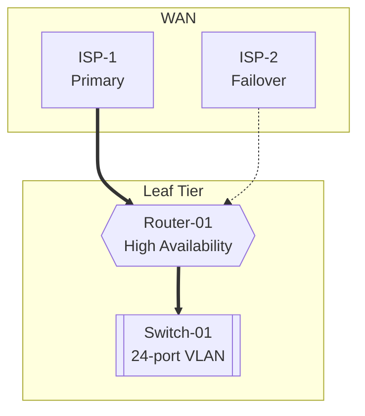

# Claude Code Integration Guide

Complete guide for integrating the CIM Network SDN system with Claude Code using the MCP (Model Context Protocol) server.

## 🚀 Quick Setup

### 1. MCP Server Configuration

Add this configuration to your Claude Code MCP settings:

```json
{
  "mcpServers": {
    "cim-network-sdn": {
      "command": "python3",
      "args": ["-m", "cim_network_mcp"],
      "cwd": "/path/to/cim-network",
      "env": {
        "PYTHONPATH": "/path/to/cim-network"
      }
    }
  }
}
```

### 2. Verify Installation

Test the MCP server connection:

```bash
cd /path/to/cim-network
nix develop --command python3 test_complete_integration.py
```

You should see: **✅ 100% success rate** with all integration tests passing.

## 🛠️ Available Tools

The CIM Network MCP server provides **8 specialized tools** for interactive network building:

### Core Network Tools

#### 1. **initialize_sdn**
Initialize a Software Defined Network from a domain context.

```json
{
  "name": "initialize_sdn",
  "arguments": {
    "domain_context": {
      "domain_name": "my-company-network",
      "base_network": "10.0.0.0/8",
      "environment": "production"
    },
    "base_config": "leaf"  // "dev" or "leaf"
  }
}
```

#### 2. **create_base_topology**
Create a complete base network topology (dev or leaf mode).

```json
// Development Mode (Single ISP, 1 public IP)
{
  "name": "create_base_topology",
  "arguments": {
    "mode": "dev",
    "name": "dev-environment",
    "primary_isp": "comcast"
  }
}

// Production Mode (Dual ISP, 16 public IPs)
{
  "name": "create_base_topology",
  "arguments": {
    "mode": "leaf",
    "name": "branch-office",
    "primary_isp": "verizon-business",
    "failover_isp": "att-business"
  }
}
```

#### 3. **add_sdn_node**
Add individual nodes to the network topology.

```json
{
  "name": "add_sdn_node",
  "arguments": {
    "node_id": "app-server-01",
    "node_type": "server",
    "tier": "cluster",
    "interfaces": [
      {
        "name": "eth0",
        "type": "ethernet",
        "addresses": ["10.0.1.10"]
      }
    ],
    "services": ["nginx", "postgresql"],
    "metadata": {
      "role": "application-server",
      "environment": "production"
    }
  }
}
```

#### 4. **connect_sdn_nodes**
Establish connections between network nodes.

```json
{
  "name": "connect_sdn_nodes",
  "arguments": {
    "from_node": "load-balancer",
    "to_node": "app-server-01",
    "connection_type": "ethernet",
    "properties": {
      "bandwidth": "10Gbps",
      "redundant": "true"
    }
  }
}
```

### Configuration Generation Tools

#### 5. **generate_nix_topology**
Generate nix-topology compliant NixOS configurations.

```json
{
  "name": "generate_nix_topology",
  "arguments": {
    "format": "nixos",      // nixos, nix-darwin, home-manager, flake
    "mode": "leaf"          // dev or leaf
  }
}
```

#### 6. **visualize_topology**
Generate visual representations of the network topology.

```json
{
  "name": "visualize_topology", 
  "arguments": {
    "format": "mermaid",           // ascii, mermaid, dot, svg
    "layout": "tier-based",        // hierarchical, tier-based, force-directed
    "color_scheme": "blue",        // default, dark, blue, enterprise
    "show_details": true
  }
}
```

### State Management Tools

#### 7. **get_sdn_state**
Retrieve the current state of the Software Defined Network.

```json
{
  "name": "get_sdn_state",
  "arguments": {}
}
```

#### 8. **export_context_graph**
Export the cim-graph ContextGraph representing the SDN.

```json
{
  "name": "export_context_graph",
  "arguments": {
    "format": "json"    // json, dot, cypher
  }
}
```

## 📋 Common Workflows

### Quick Development Setup

```bash
# Ask Claude Code to:
1. "Create a development network for a 5-person team"
2. "Add a database server and web server" 
3. "Generate NixOS configuration for deployment"
4. "Show me an ASCII visualization of the topology"
```

Claude Code will use these tools:
```json
create_base_topology(mode="dev", name="team-network", primary_isp="local-isp")
add_sdn_node(node_id="db-server", node_type="server", services=["postgresql"])
add_sdn_node(node_id="web-server", node_type="server", services=["nginx"])
generate_nix_topology(format="nixos", mode="dev")
visualize_topology(format="ascii", layout="tier-based")
```

### Production Branch Office

```bash
# Ask Claude Code to:
1. "Set up a production branch office with high availability"
2. "Configure dual ISP failover with load balancing" 
3. "Add application cluster with database replication"
4. "Generate enterprise network documentation"
```

Claude Code will use these tools:
```json
create_base_topology(mode="leaf", primary_isp="verizon", failover_isp="comcast")
add_sdn_node(node_id="app-01", tier="cluster", services=["nginx", "app"])
add_sdn_node(node_id="db-primary", services=["postgresql", "replication"])
connect_sdn_nodes(from_node="app-01", to_node="db-primary")
visualize_topology(format="mermaid", color_scheme="enterprise")
export_context_graph(format="json")
```

## 🎨 Visualization Formats

### ASCII Art (Terminal-Friendly)
Perfect for command-line tools and documentation in terminal environments.

```
╔═══════════════════════════════════════════════════════════════╗
║                    NETWORK TOPOLOGY (ASCII)                  ║
╠═══════════════════════════════════════════════════════════════╣
║                          WAN TIER                             ║
╠═══════════════════════════════════════════════════════════════╣
║     [ISP-1] ════════════════════╗                             ║
║                                 ║                             ║
║     [ISP-2] ══════════════════╗ ║                             ║
╠═══════════════════════════════╬═╬═════════════════════════════╣
║                    LEAF TIER  ║ ║                             ║
║                        ◆ ROUTER-01 ◆ (High Availability)     ║
║                               ║                               ║
║                          ⬢ SWITCH-01 ⬢                       ║
╚═══════════════════════════════════════════════════════════════╝
```

### Mermaid Diagrams (Documentation)
Great for GitHub README files and technical documentation.



### Graphviz DOT (Professional Presentations)
Perfect for generating high-quality diagrams for presentations and reports.

### SVG (Interactive Web)
Scalable vector graphics for web integration and interactive applications.

## 🔧 Configuration Examples

### Dev Mode Network
- **Cost**: ~$200/month
- **ISP**: Single connection
- **Public IPs**: 1 (shared via NAT)  
- **Switch**: 8-port access
- **Network**: 192.168.1.0/24
- **Use Cases**: Development, small teams, testing

### Leaf Mode Network  
- **Cost**: ~$2,500/month
- **ISP**: Dual connection with failover
- **Public IPs**: 16 (8 per ISP)
- **Switch**: 24-port with VLAN
- **Network**: 10.0.1.0/24
- **Use Cases**: Production, branch offices, enterprise

## 📊 Interactive Examples

### Example 1: Simple Development Environment

**Claude Code Prompt:**
> "I need a simple development environment for 3 developers working on a web application with a database backend. Keep costs low but make it functional."

**Expected Claude Code Actions:**
1. `create_base_topology(mode="dev", name="webdev-team", primary_isp="local-broadband")`
2. `add_sdn_node(node_id="dev-db", services=["postgresql", "redis"])`
3. `add_sdn_node(node_id="staging-web", services=["nginx", "nodejs"])`
4. `connect_sdn_nodes(from_node="staging-web", to_node="dev-db")`
5. `generate_nix_topology(format="nixos", mode="dev")`
6. `visualize_topology(format="ascii")`

**Result:** Complete development environment with database, web server, and deployment-ready NixOS configuration.

### Example 2: Production Branch Office

**Claude Code Prompt:**
> "Set up a production branch office network that can handle 50 users with 99.9% uptime requirements. Include redundancy and monitoring."

**Expected Claude Code Actions:**
1. `create_base_topology(mode="leaf", primary_isp="fiber-provider", failover_isp="cable-backup")`
2. `add_sdn_node(node_id="load-balancer", services=["haproxy", "ssl-termination"])`
3. `add_sdn_node(node_id="app-server-01", tier="cluster", services=["app", "monitoring"])`
4. `add_sdn_node(node_id="app-server-02", tier="cluster", services=["app", "monitoring"])`
5. `add_sdn_node(node_id="db-primary", services=["postgresql", "backup"])`
6. `add_sdn_node(node_id="db-replica", services=["postgresql", "readonly"])`
7. `connect_sdn_nodes` for each service connection
8. `generate_nix_topology(format="nixos", mode="leaf")`
9. `visualize_topology(format="mermaid", color_scheme="enterprise")`

**Result:** Enterprise-grade branch office with high availability, load balancing, database replication, and comprehensive monitoring.

### Example 3: Network Visualization and Documentation

**Claude Code Prompt:**
> "Create comprehensive documentation for our network topology including diagrams in multiple formats for different audiences."

**Expected Claude Code Actions:**
1. `get_sdn_state()` - Get current network state
2. `visualize_topology(format="ascii")` - Terminal-friendly diagram
3. `visualize_topology(format="mermaid", color_scheme="blue")` - Documentation diagram  
4. `visualize_topology(format="dot")` - Professional presentation diagram
5. `visualize_topology(format="svg")` - Interactive web diagram
6. `export_context_graph(format="json")` - Technical documentation
7. `generate_nix_topology(format="flake")` - Deployment configuration

**Result:** Complete documentation package with multiple visualization formats suitable for different audiences and use cases.

## 🚦 Best Practices

### 1. Start Simple
- Begin with dev mode for development and testing
- Gradually evolve to leaf mode for production
- Use visualization tools to understand topology

### 2. Plan for Growth  
- Dev mode: 2-10 people, single office
- Leaf mode: 10-100 people, branch office/production
- Consider multi-site for larger deployments

### 3. Use Appropriate Tools
- **ASCII**: Terminal output, CLI documentation
- **Mermaid**: GitHub README, technical docs
- **DOT**: Professional presentations, reports  
- **SVG**: Web integration, interactive tools

### 4. Leverage Configuration Generation
- Always generate NixOS configs for Infrastructure as Code
- Use mode-specific generation (dev vs leaf)
- Validate configurations before deployment

### 5. Document Everything
- Export context graphs for technical documentation
- Create multiple visualization formats
- Maintain network state documentation

## 🔍 Troubleshooting

### MCP Server Not Starting
```bash
# Check server directly
cd /path/to/cim-network
nix develop --command python3 -m cim_network_mcp

# Verify environment
echo $PYTHONPATH
ls -la cim_network_mcp/
```

### Tools Not Available
```bash
# Test tool listing
echo '{"jsonrpc": "2.0", "method": "tools/list", "id": 1}' | \
  nix develop --command python3 -m cim_network_mcp
```

### Configuration Issues
```bash
# Run integration tests
nix develop --command python3 test_complete_integration.py

# Check visualization
nix develop --command python3 test_visualization.py
```

## 🎯 Advanced Usage

### Custom Network Patterns
Use the base topologies as starting points and extend with custom nodes and connections to create specialized network patterns.

### Multi-Environment Workflows  
Create separate dev and production topologies that share common patterns but differ in scale and redundancy.

### Infrastructure as Code
Generate NixOS configurations that can be version-controlled and deployed reproducibly across environments.

### Compliance and Documentation
Use context graph exports and visualization tools to maintain compliance documentation and network inventories.

---

## ✅ Validation Checklist

Before using in production:

- [ ] MCP server starts successfully
- [ ] All 8 tools are available  
- [ ] Base topologies (dev/leaf) create successfully
- [ ] Visualizations generate in all formats
- [ ] NixOS configurations are valid
- [ ] Integration tests pass (100% success rate)

The CIM Network SDN system is ready for production use with Claude Code! 🚀