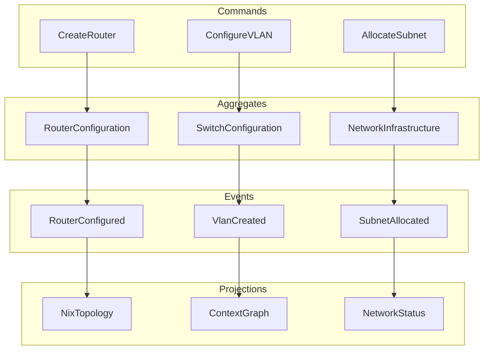

# CIM Network Module

Network infrastructure management for the Composable Information Machine.

## Overview

The cim-network module manages real-world network infrastructure through an event-driven architecture. It handles:

- Physical network devices (routers, switches, firewalls)
- Virtual networks for containers and VMs
- VLAN management and configuration
- IP address allocation and management
- Network topology visualization
- Nix-based deployment configurations

## Key Features

- **Multi-vendor Support**: Cisco IOS, Juniper JunOS, VyOS, MikroTik
- **Container Integration**: Docker, Podman, and Kubernetes networking
- **VM Integration**: Libvirt, VMware, Hyper-V support
- **Event Sourcing**: Complete audit trail of all network changes
- **Nix Deployment**: Declarative, reproducible network configurations
- **Context Graphs**: Visual representation of network topology

## Architecture



## Quick Start

```rust
use cim_network::{NetworkService, RouterConfiguration, RouterVendor};

// Create network service
let service = NetworkService::new(event_store);

// Add a router
let router = service.add_router(
    "edge-router-01",
    RouterVendor::Cisco { os: CiscoOs::Ios15_7 }
).await?;

// Configure interfaces
service.configure_router_interfaces(router.id, vec![
    Interface {
        name: "GigabitEthernet0/0",
        ip_address: "192.168.1.1/24",
        enabled: true,
    }
]).await?;

// Deploy via Nix
let nix_config = service.generate_nix_config(router.id).await?;
service.deploy_via_nix(nix_config).await?;
```

## Documentation

- [Design Document](doc/design/design.md)
- [User Stories](doc/design/user-stories.md)
- [API Reference](doc/api/index.md)
- [Configuration Guide](doc/guides/configuration.md)

## License

MIT OR Apache-2.0