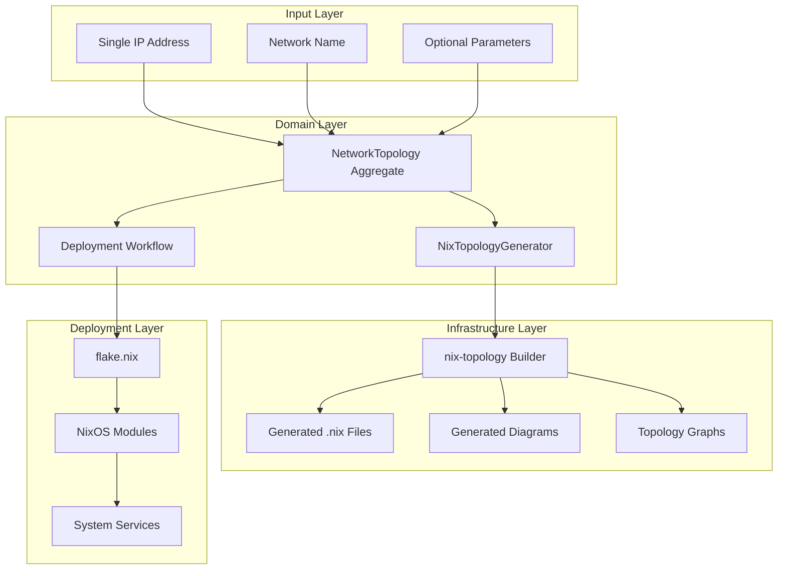

# CIM-Network Nix-Topology Architecture

## Overview

The CIM-Network module integrates with `nix-topology` to provide **declarative network infrastructure** that can be deployed from a single IP address and name to a complete, reproducible network configuration.

## Architecture Components



## Domain Model Extensions

### NetworkTopology Aggregate

```rust
pub struct NetworkTopology {
    id: NetworkTopologyId,
    name: String,
    base_ip: IpNetwork,
    topology_type: TopologyType,
    devices: HashMap<DeviceId, NetworkDevice>,
    connections: Vec<NetworkConnection>,
    nix_config: Option<NixTopologyConfig>,
    version: u64,
}

pub enum TopologyType {
    SingleRouter,
    RouterSwitch,
    ThreeTier { 
        core_count: u8, 
        distribution_count: u8, 
        access_count: u8 
    },
    Spine { 
        spine_count: u8, 
        leaf_count: u8 
    },
    Custom(CustomTopologySpec),
}

pub struct NetworkDevice {
    id: DeviceId,
    name: String,
    device_type: DeviceType,
    ip_address: IpAddr,
    interfaces: Vec<InterfaceSpec>,
    nix_module: Option<String>,
}

pub struct NetworkConnection {
    id: ConnectionId,
    source: (DeviceId, InterfaceId),
    target: (DeviceId, InterfaceId),
    connection_type: ConnectionType,
    vlan: Option<VlanId>,
}
```

### NixTopologyConfig

```rust
pub struct NixTopologyConfig {
    topology_name: String,
    base_network: IpNetwork,
    devices: Vec<NixDevice>,
    networks: Vec<NixNetwork>,
    rendered_config: Option<String>,
    mermaid_diagram: Option<String>,
    graph_json: Option<String>,
}

pub struct NixDevice {
    name: String,
    device_type: NixDeviceType,
    image: Option<String>,
    interfaces: Vec<NixInterface>,
    services: Vec<String>,
}

pub enum NixDeviceType {
    Router,
    Switch,
    Host,
    Container,
    VM,
}

pub struct NixNetwork {
    name: String,
    cidr: String,
    vlan: Option<u16>,
    dhcp: bool,
}
```

## Workflow Integration

### Network Deployment Workflow with Nix-Topology

```rust
pub struct NixTopologyDeploymentWorkflow {
    network_id: NetworkId,
    base_ip: IpNetwork,
    network_name: String,
    topology_type: TopologyType,
    deployment_target: DeploymentTarget,
}

pub enum DeploymentTarget {
    Local,
    Remote { host: String, ssh_key: String },
    Container { runtime: ContainerRuntime },
    VM { hypervisor: Hypervisor },
}
```

### Workflow Steps

1. **Generate Topology**: Create network topology from IP/name
2. **Render Nix-Topology**: Convert to nix-topology format
3. **Generate Documentation**: Create Mermaid diagrams and graphs
4. **Build Configuration**: Generate NixOS modules and flake
5. **Deploy**: Apply configuration to target environment
6. **Verify**: Test connectivity and services

## Integration with nix-topology

### nix-topology Configuration Format

```nix
# Generated topology.nix
{ 
  networks = {
    lan = {
      cidr = "192.168.1.0/24";
      enableDHCP = false;
    };
  };
  
  nodes = {
    router = {
      deviceType = "router";
      image = "nixos/router";
      interfaces.eth0 = {
        network = "lan";
        address = "192.168.1.1/24";
      };
    };
    
    switch = {
      deviceType = "switch";
      image = "nixos/switch";  
      interfaces.eth0.network = "lan";
    };
  };
  
  connections = [
    { from = "router.eth0"; to = "switch.eth0"; }
  ];
}
```

### Generated NixOS Modules

```nix
# modules/router.nix
{ config, lib, pkgs, ... }:

{
  networking = {
    hostName = "cim-router";
    interfaces.eth0 = {
      ipv4.addresses = [{
        address = "192.168.1.1";
        prefixLength = 24;
      }];
    };
    firewall.enable = false;
  };
  
  services.quagga = {
    zebra.enable = true;
    ospf.enable = true;
    ospf.config = ''
      router ospf
        ospf router-id 192.168.1.1
        network 192.168.1.0/24 area 0
    '';
  };
}
```

### Flake Integration

```nix
# flake.nix (generated)
{
  description = "CIM Network Deployment: my-network";
  
  inputs = {
    nixpkgs.url = "github:NixOS/nixpkgs/nixos-unstable";
    nix-topology.url = "github:oddlama/nix-topology";
    cim-network.url = "github:thecowboyai/cim-network";
  };
  
  outputs = { self, nixpkgs, nix-topology, cim-network, ... }:
    let
      system = "x86_64-linux";
      pkgs = nixpkgs.legacyPackages.${system};
    in {
      # Network topology visualization
      topology = nix-topology.lib.mkTopology {
        inherit pkgs;
        modules = [
          ./topology.nix
        ];
      };
      
      # NixOS configurations for each device
      nixosConfigurations = {
        router = nixpkgs.lib.nixosSystem {
          inherit system;
          modules = [
            ./modules/router.nix
            cim-network.nixosModules.router
          ];
        };
        
        switch = nixpkgs.lib.nixosSystem {
          inherit system;
          modules = [
            ./modules/switch.nix
            cim-network.nixosModules.switch
          ];
        };
      };
      
      # Development shell
      devShells.default = pkgs.mkShell {
        buildInputs = with pkgs; [
          nixos-rebuild
          nix-topology.packages.${system}.default
        ];
        
        shellHook = ''
          echo "CIM Network Deployment Environment"
          echo "Run 'nix run .#topology' to generate network diagram"
          echo "Run 'nixos-rebuild switch --flake .#router' to deploy router"
        '';
      };
    };
}
```

## Generated Documentation

### Mermaid Network Diagram


### JSON Graph Structure

```json
{
  "network": {
    "name": "my-network",
    "cidr": "192.168.1.0/24"
  },
  "devices": [
    {
      "id": "router",
      "name": "Router",
      "type": "router",
      "ip": "192.168.1.1",
      "interfaces": ["eth0", "eth1"]
    },
    {
      "id": "switch", 
      "name": "Switch",
      "type": "switch",
      "ip": "192.168.1.2",
      "interfaces": ["eth0", "eth1-eth23"]
    }
  ],
  "connections": [
    {
      "source": {"device": "router", "interface": "eth0"},
      "target": {"device": "switch", "interface": "eth0"}
    }
  ]
}
```

## API Design

### Simple Deployment API

```rust
pub async fn deploy_network_from_ip(
    ip: IpNetwork,
    name: String,
    options: DeploymentOptions,
) -> Result<DeploymentResult, NetworkError> {
    // 1. Create NetworkTopology aggregate
    // 2. Execute NixTopologyDeploymentWorkflow  
    // 3. Generate all files and documentation
    // 4. Return paths to generated artifacts
}

pub struct DeploymentOptions {
    pub topology_type: Option<TopologyType>,
    pub target: DeploymentTarget,
    pub generate_docs: bool,
    pub output_dir: PathBuf,
}

pub struct DeploymentResult {
    pub topology_id: NetworkTopologyId,
    pub nix_files: Vec<PathBuf>,
    pub flake_path: PathBuf,
    pub documentation: DocumentationPaths,
    pub deployment_events: Vec<NetworkEvent>,
}

pub struct DocumentationPaths {
    pub mermaid_diagram: Option<PathBuf>,
    pub json_graph: Option<PathBuf>,
    pub topology_svg: Option<PathBuf>,
    pub readme: Option<PathBuf>,
}
```

## Claude Subagent Specification

The subagent should be designed to:

1. **Understand Network Requirements**: Parse IP/name input and infer topology needs
2. **Generate Complete Solutions**: Create all Nix files, modules, and documentation
3. **Follow CIM Patterns**: Maintain DDD, event sourcing, and workflow patterns  
4. **Create Visual Documentation**: Generate Mermaid diagrams and topology graphs
5. **Ensure Reproducibility**: Generate deterministic, version-controlled configurations

### Subagent Tasks:

- Implement `NetworkTopologyGenerator`
- Create `NixTopologyRenderer` 
- Build documentation generators
- Implement deployment workflows
- Generate test scenarios
- Create example configurations

This architecture provides a complete path from **single IP + name** to **deployed network infrastructure** with full documentation and reproducible configurations using nix-topology.