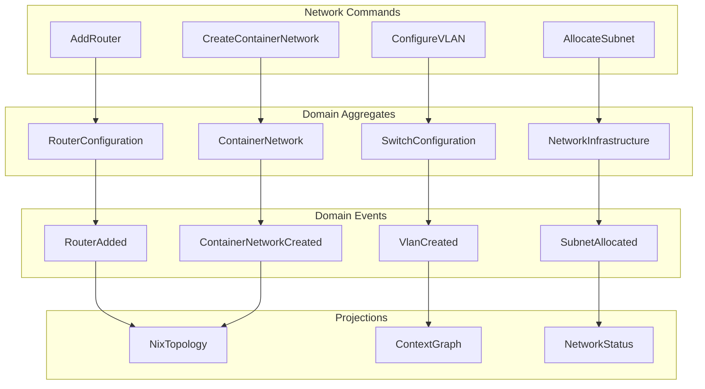
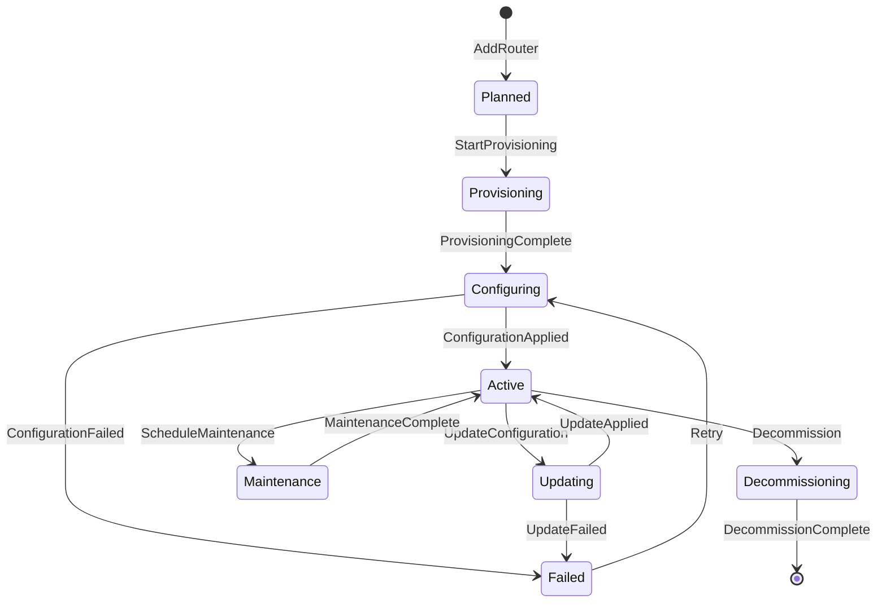

# CIM Network Infrastructure Design

## Overview

The cim-network module manages physical and virtual network infrastructure through event-driven architecture, following CIM patterns for living information.



## Domain Model

### Core Value Objects

```rust
// Network identifiers
pub struct NetworkId(Uuid);
pub struct RouterId(Uuid);
pub struct SwitchId(Uuid);
pub struct VlanId(u16); // 1-4094
pub struct ContainerNetworkId(Uuid);

// Network primitives
pub struct MacAddress([u8; 6]);
pub struct IpNetwork(ipnetwork::IpNetwork);
pub struct PortNumber(u32);

// Correlation tracking (MANDATORY)
pub struct CorrelationId(Uuid);
pub struct CausationId(Uuid);
pub struct EventId(Uuid);
```

### Network Device Aggregates

```rust
pub struct RouterConfiguration {
    pub id: RouterId,
    pub name: String,
    pub vendor: RouterVendor,
    pub model: String,
    pub interfaces: Vec<RouterInterface>,
    pub routing_protocols: Vec<RoutingProtocol>,
    pub access_lists: Vec<AccessList>,
    pub version: u64, // For optimistic concurrency
}

pub enum RouterVendor {
    Cisco { os: CiscoOs },
    Juniper { os: JunosVersion },
    Vyos { version: String },
    Mikrotik { os: RouterOsVersion },
    Linux { distro: LinuxDistro },
}

pub struct RouterInterface {
    pub name: String,              // e.g., "GigabitEthernet0/0"
    pub ip_address: Option<IpNetwork>,
    pub description: Option<String>,
    pub enabled: bool,
    pub speed: Option<InterfaceSpeed>,
    pub duplex: Option<DuplexMode>,
}

pub struct SwitchConfiguration {
    pub id: SwitchId,
    pub name: String,
    pub vendor: SwitchVendor,
    pub model: String,
    pub ports: Vec<SwitchPort>,
    pub vlans: HashMap<VlanId, Vlan>,
    pub spanning_tree: SpanningTreeConfig,
}

pub struct Vlan {
    pub id: VlanId,
    pub name: String,
    pub description: Option<String>,
    pub subnet: Option<IpNetwork>,
    pub tagged_ports: Vec<PortNumber>,
    pub untagged_ports: Vec<PortNumber>,
}
```

### Container Network Aggregates

```rust
pub struct ContainerNetwork {
    pub id: ContainerNetworkId,
    pub name: String,
    pub driver: NetworkDriver,
    pub vlan_id: Option<VlanId>,      // Integration with physical network
    pub subnet: IpNetwork,
    pub gateway: Option<IpAddr>,
    pub dns_servers: Vec<IpAddr>,
    pub containers: HashMap<ContainerId, ContainerAllocation>,
}

pub enum NetworkDriver {
    Bridge {
        bridge_name: String,
        enable_icc: bool,  // Inter-container communication
        mtu: u32,
    },
    Overlay {
        encryption: bool,
        vxlan_id: Option<u32>,
    },
    Macvlan {
        parent_interface: String,
        mode: MacvlanMode,
    },
}

pub struct ContainerAllocation {
    pub container_id: ContainerId,
    pub ip_address: IpAddr,
    pub mac_address: MacAddress,
    pub hostname: String,
}
```

## Event Model

### Event Metadata (MANDATORY for all events)

```rust
#[derive(Debug, Clone, Serialize, Deserialize)]
pub struct EventMetadata {
    pub event_id: EventId,
    pub aggregate_id: AggregateId,
    pub correlation_id: CorrelationId,  // NEVER optional
    pub causation_id: CausationId,      // NEVER optional
    pub timestamp: DateTime<Utc>,
    pub version: u64,
    pub actor: Actor,
}

#[derive(Debug, Clone, Serialize, Deserialize)]
pub enum Actor {
    User { id: UserId, name: String },
    System { component: String },
    Service { name: String, instance: String },
}
```

### Network Events

```rust
#[derive(Debug, Clone, Serialize, Deserialize)]
pub enum NetworkEvent {
    // Router events
    RouterAdded {
        metadata: EventMetadata,
        router_id: RouterId,
        name: String,
        vendor: RouterVendor,
        model: String,
    },
    RouterConfigurationApplied {
        metadata: EventMetadata,
        router_id: RouterId,
        configuration_snapshot: RouterConfigSnapshot,
        deployment_method: DeploymentMethod,
    },
    RouterInterfaceConfigured {
        metadata: EventMetadata,
        router_id: RouterId,
        interface: RouterInterface,
    },
    
    // Switch events
    SwitchAdded {
        metadata: EventMetadata,
        switch_id: SwitchId,
        name: String,
        vendor: SwitchVendor,
        port_count: u32,
    },
    VlanCreated {
        metadata: EventMetadata,
        switch_id: SwitchId,
        vlan: Vlan,
    },
    PortConfigured {
        metadata: EventMetadata,
        switch_id: SwitchId,
        port: SwitchPort,
    },
    
    // Container network events
    ContainerNetworkCreated {
        metadata: EventMetadata,
        network: ContainerNetwork,
    },
    ContainerAttached {
        metadata: EventMetadata,
        network_id: ContainerNetworkId,
        allocation: ContainerAllocation,
    },
    
    // IP management events
    SubnetAllocated {
        metadata: EventMetadata,
        subnet: IpNetwork,
        purpose: String,
        allocated_from: IpNetwork,
    },
}
```

## Command Model

```rust
#[derive(Debug, Clone, Serialize, Deserialize)]
pub struct CommandMetadata {
    pub command_id: CommandId,
    pub correlation_id: CorrelationId,
    pub timestamp: DateTime<Utc>,
    pub actor: Actor,
}

#[derive(Debug, Clone, Serialize, Deserialize)]
pub enum NetworkCommand {
    // Router commands
    AddRouter {
        metadata: CommandMetadata,
        router_id: RouterId,
        name: String,
        vendor: RouterVendor,
        model: String,
    },
    ApplyRouterConfiguration {
        metadata: CommandMetadata,
        router_id: RouterId,
        configuration: RouterConfigIntent,
        validation_mode: ValidationMode,
    },
    
    // Switch commands
    AddSwitch {
        metadata: CommandMetadata,
        switch_id: SwitchId,
        name: String,
        vendor: SwitchVendor,
        port_count: u32,
    },
    CreateVlan {
        metadata: CommandMetadata,
        switch_id: SwitchId,
        vlan_id: VlanId,
        name: String,
        subnet: Option<IpNetwork>,
    },
    
    // Container commands
    CreateContainerNetwork {
        metadata: CommandMetadata,
        network_id: ContainerNetworkId,
        name: String,
        driver: NetworkDriver,
        vlan_id: Option<VlanId>,
        subnet: IpNetwork,
    },
}
```

## State Machines

### Router State Machine



```rust
// Type-safe state machine with phantom types
pub struct RouterStateMachine<S> {
    pub router_id: RouterId,
    pub name: String,
    pub vendor: RouterVendor,
    _state: PhantomData<S>,
}

// States
pub struct Planned;
pub struct Provisioning;
pub struct Configuring;
pub struct Active;
pub struct Failed { pub reason: String }
pub struct Maintenance { pub window: MaintenanceWindow }
pub struct Decommissioning;

// Transitions
impl RouterStateMachine<Planned> {
    pub fn start_provisioning(self) -> Result<RouterStateMachine<Provisioning>, RouterError> {
        // Emit RouterProvisioningStarted event
        Ok(RouterStateMachine {
            router_id: self.router_id,
            name: self.name,
            vendor: self.vendor,
            _state: PhantomData,
        })
    }
}
```

## Configuration Generation

### Router Configuration Generator

```rust
pub trait RouterConfigGenerator {
    fn generate_config(&self, router: &RouterConfiguration) -> Result<String, ConfigError>;
    fn validate_config(&self, config: &str) -> Result<(), ConfigError>;
}

pub struct CiscoIosGenerator;

impl RouterConfigGenerator for CiscoIosGenerator {
    fn generate_config(&self, router: &RouterConfiguration) -> Result<String, ConfigError> {
        let mut config = String::new();
        
        // Basic configuration
        writeln!(config, "hostname {}", router.name)?;
        writeln!(config, "!")?;
        
        // Interfaces
        for interface in &router.interfaces {
            writeln!(config, "interface {}", interface.name)?;
            if let Some(ip) = &interface.ip_address {
                writeln!(config, " ip address {} {}", ip.ip(), ip.netmask())?;
            }
            if let Some(desc) = &interface.description {
                writeln!(config, " description {}", desc)?;
            }
            writeln!(config, " {}", if interface.enabled { "no shutdown" } else { "shutdown" })?;
            writeln!(config, "!")?;
        }
        
        // Routing protocols
        for protocol in &router.routing_protocols {
            match protocol {
                RoutingProtocol::Ospf { process_id, areas } => {
                    writeln!(config, "router ospf {}", process_id)?;
                    for area in areas {
                        for network in &area.networks {
                            writeln!(config, " network {} area {}", network, area.id)?;
                        }
                    }
                    writeln!(config, "!")?;
                }
                // Other protocols...
            }
        }
        
        Ok(config)
    }
}
```

## Nix Integration

### Topology Generator

```rust
pub struct NixTopologyGenerator;

impl NixTopologyGenerator {
    pub fn generate_topology(&self, infra: &NetworkInfrastructure) -> Result<NixModule, NixError> {
        NixModule {
            name: "network-topology".to_string(),
            imports: vec![],
            options: self.generate_options(&infra)?,
            config: self.generate_config(&infra)?,
        }
    }
    
    fn generate_router_module(&self, router: &RouterConfiguration) -> NixExpression {
        nix_expr! {
            networking.routers.${router.name} = {
                vendor = ${router.vendor.to_string()};
                configFile = pkgs.writeText "router-config" ''
                    ${self.generate_router_config(router)?}
                '';
                interfaces = ${self.generate_interfaces(&router.interfaces)};
            };
        }
    }
}
```

## Container Network Integration

```rust
impl ContainerNetworkService {
    pub async fn create_network_with_vlan(
        &self,
        spec: ContainerNetworkSpec,
    ) -> Result<ContainerNetwork, NetworkError> {
        // Verify VLAN exists
        let vlan = self.verify_vlan_exists(spec.vlan_id).await?;
        
        // Allocate subnet from VLAN range
        let subnet = self.allocate_subnet_from_vlan(&vlan, spec.subnet_size).await?;
        
        // Create container network
        let network = ContainerNetwork {
            id: ContainerNetworkId::new(),
            name: spec.name,
            driver: NetworkDriver::Bridge {
                bridge_name: format!("br-vlan{}", vlan.id.0),
                enable_icc: true,
                mtu: 1500,
            },
            vlan_id: Some(vlan.id),
            subnet,
            gateway: Some(subnet.nth(1).unwrap()),
            dns_servers: vec![],
            containers: HashMap::new(),
        };
        
        // Configure physical switch ports
        self.configure_trunk_ports_for_vlan(vlan.id).await?;
        
        // Emit event
        self.emit_event(NetworkEvent::ContainerNetworkCreated {
            metadata: EventMetadata::new(
                self.correlation_id.clone(),
                self.correlation_id.clone(),
            ),
            network: network.clone(),
        }).await?;
        
        Ok(network)
    }
}
```

## Context Graph Projection

```rust
pub struct NetworkContextGraph {
    graph: Graph<NetworkNode, NetworkEdge>,
    node_index: HashMap<String, NodeIndex>,
}

pub enum NetworkNode {
    Router {
        id: RouterId,
        name: String,
        state: RouterState,
        interfaces: Vec<Interface>,
    },
    Switch {
        id: SwitchId,
        name: String,
        vlans: Vec<VlanId>,
        ports: Vec<PortInfo>,
    },
    Container {
        id: ContainerId,
        name: String,
        network: ContainerNetworkId,
        ip: IpAddr,
    },
    Subnet {
        network: IpNetwork,
        vlan_id: Option<VlanId>,
        usage: SubnetUsage,
    },
}

pub enum NetworkEdge {
    Physical {
        medium: PhysicalMedium,
        bandwidth: Bandwidth,
    },
    Virtual {
        vlan_id: Option<VlanId>,
        tunnel_type: Option<TunnelType>,
    },
    Logical {
        relationship: LogicalRelationship,
    },
}

impl NetworkContextGraph {
    pub fn to_mermaid(&self) -> String {
        let mut mermaid = String::from("graph TB\n");
        
        // Render nodes
        for (idx, node) in self.graph.node_indices().zip(self.graph.node_weights()) {
            match node {
                NetworkNode::Router { name, state, .. } => {
                    writeln!(mermaid, "    R{}[fa:fa-router {} - {:?}]", 
                        idx.index(), name, state).unwrap();
                }
                NetworkNode::Switch { name, vlans, .. } => {
                    writeln!(mermaid, "    S{}[fa:fa-switch {} - {} VLANs]", 
                        idx.index(), name, vlans.len()).unwrap();
                }
                // Other nodes...
            }
        }
        
        // Render edges
        for edge in self.graph.edge_indices() {
            let (src, dst) = self.graph.edge_endpoints(edge).unwrap();
            let edge_data = &self.graph[edge];
            match edge_data {
                NetworkEdge::Physical { bandwidth, .. } => {
                    writeln!(mermaid, "    {} ---|{}| {}", 
                        src.index(), bandwidth, dst.index()).unwrap();
                }
                // Other edges...
            }
        }
        
        mermaid
    }
}
```

## Testing Strategy

### Unit Tests
```rust
#[cfg(test)]
mod tests {
    use super::*;
    
    #[test]
    fn test_vlan_id_validation() {
        assert!(VlanId::try_new(1).is_ok());
        assert!(VlanId::try_new(4094).is_ok());
        assert!(VlanId::try_new(0).is_err());      // Reserved
        assert!(VlanId::try_new(4095).is_err());   // Reserved
    }
    
    #[test]
    fn test_router_state_transitions() {
        let router = RouterStateMachine::<Planned>::new(
            RouterId::new(),
            "test-router".to_string(),
            RouterVendor::Cisco { os: CiscoOs::Ios15_7 },
        );
        
        let provisioning = router.start_provisioning().unwrap();
        // Can't go directly to active (won't compile)
        // let active = router.activate(); // COMPILE ERROR
    }
    
    #[test]
    fn test_event_has_mandatory_fields() {
        let event = NetworkEvent::router_added(
            RouterId::new(),
            "router1".to_string(),
        );
        
        assert!(!event.metadata().correlation_id.is_empty());
        assert!(!event.metadata().causation_id.is_empty());
    }
}
```

### Integration Tests
```rust
#[tokio::test]
async fn test_container_network_with_vlan_integration() {
    let service = NetworkService::new(event_store);
    
    // Create infrastructure
    let switch = service.add_switch("core-switch", SwitchVendor::Cisco).await?;
    
    // Create VLAN
    service.create_vlan(switch.id, 100, "containers").await?;
    
    // Create container network
    let network = service.create_container_network(
        "app-network",
        Some(VlanId(100)),
        "10.100.0.0/24",
    ).await?;
    
    // Verify integration
    assert_eq!(network.vlan_id, Some(VlanId(100)));
    assert!(network.gateway.is_some());
}
```

## Next Steps

1. Implement core domain model
2. Create configuration generators for each vendor
3. Build Nix topology generation
4. Implement container/VM network integration
5. Add context graph visualization
6. Create comprehensive test suite